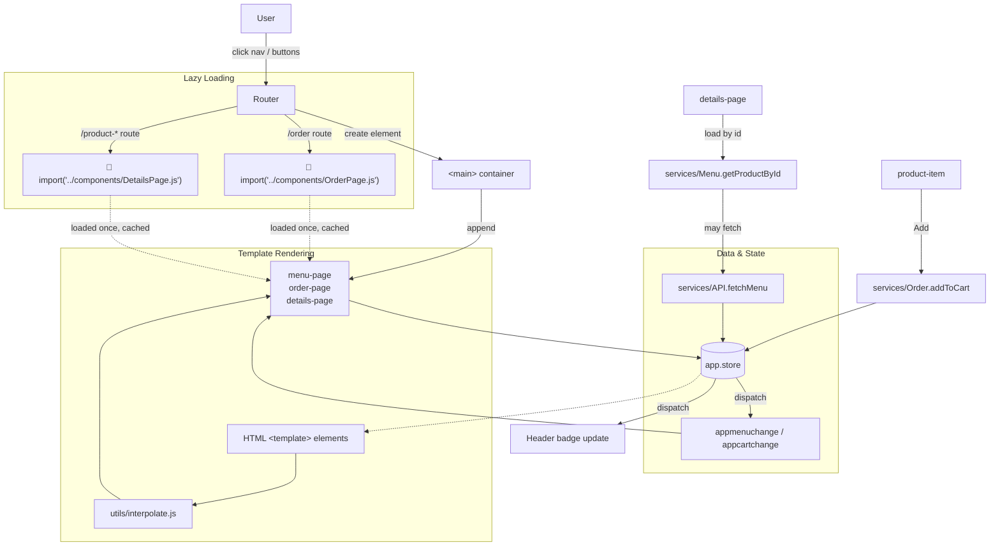
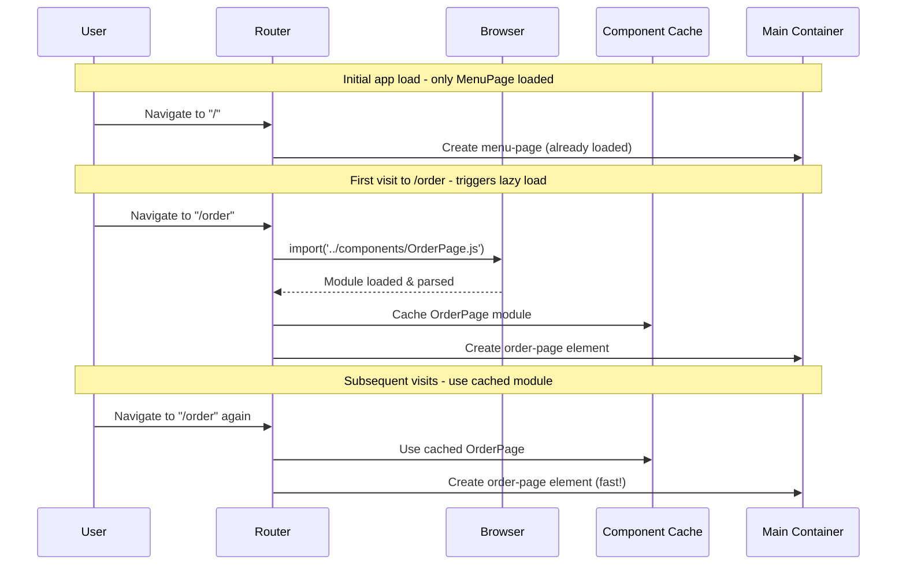
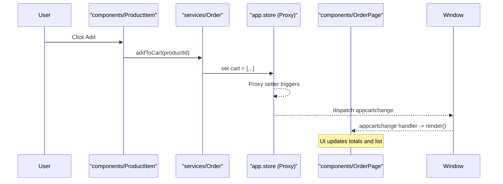
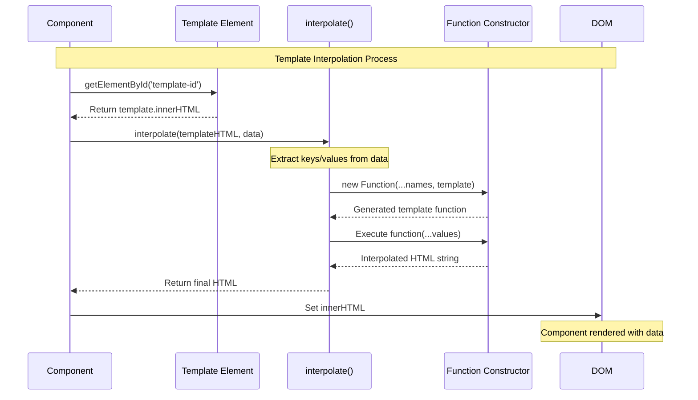

# Coffee SPA — Web Patterns Playground

A small Single Page Application to explore and practice common web patterns typically used in SPA apps: client-side routing, custom elements (Web Components), shared state via a proxy store with change events, simple data fetching, and a PWA-ready shell.

This project renders a coffee menu, product details, and an order/cart flow using vanilla JavaScript modules and the platform APIs—no framework required.

## Quick start

Because the app uses ES modules and fetches assets with absolute paths (e.g. `/data/menu.json`), run it behind a static server at the project root.

- Option A (Node):
  ```bash
  npx serve -s .
  # then open the printed URL (e.g. http://localhost:3000)
  ```
- Option B (Python 3):
  ```bash
  python3 -m http.server 3000
  # open http://localhost:3000
  ```

Notes

- Keep the project at the server root so absolute URLs like `/data/menu.json` and `/components/*.css` resolve correctly.
- A service worker is registered but currently empty; caching strategies are a future enhancement.

## What’s inside

- `index.html` — the app shell, navigation, and HTML `<template>` definitions used by components
- `app.js` — bootstraps the Router and Store, loads menu data, registers the service worker, and updates the cart badge
- `components/` — Web Components for pages and UI elements
  - `MenuPage.js`, `ProductItem.js` — Menu and item cards
  - `DetailsPage.js` — Product details and Add-to-cart
  - `OrderPage.js`, `CartItem.js` — Cart list, form, and totals
  - `*.css` — component-level styles fetched dynamically
- `services/` — app services and shared modules
  - `Router.js` — history API routing and view switching
  - `Store.js` — Proxy-based state with change events (`appmenuchange`, `appcartchange`)
  - `API.js` — fetches `/data/menu.json`
  - `Menu.js` — loads menu data and product lookup
  - `Order.js` — add/remove items from cart
- `data/menu.json`, `data/images/*` — menu dataset and product images
- `styles.css` — global styles and layout
- `app.webmanifest`, `serviceworker.js` — PWA bits (SW is a stub)

## Architecture overview

The app follows a simple triad:

- Router swaps the active page element into `<main>` based on `location.pathname`
- Store is a single source of truth (`app.store`) backed by a Proxy that emits change events
- Components render from Store and react to events to keep UI in sync

### High-level flow



### Routing

- `/` → `<menu-page>`
- `/order` → `<order-page>`
- `/product-{id}` → `<details-page>` (id is parsed from the URL)

Router listens to `popstate` and uses `history.pushState` for navigation. It removes the current page element and appends the new one into `<main>`.

#### Lazy Loading Pattern

The router implements lazy loading for better performance:

- **MenuPage** is loaded eagerly (imported at app startup)
- **OrderPage** and **DetailsPage** use dynamic imports and are loaded only when needed

```javascript
// Lazy loading example from Router.js
case '/order':
  await import('../components/OrderPage.js');
  pageElement = document.createElement('order-page');
  break;
```

**Benefits:**

- Reduces initial bundle size
- Improves page load performance
- Modules are cached after first load
- Users only download code for features they use

#### View Transitions Pattern

The router uses the modern View Transitions API for smooth page changes:

```javascript
// View transitions with progressive enhancement
if (document.startViewTransition) {
  document.startViewTransition(() => {
    changePage();
  });
} else {
  changePage(); // Fallback for unsupported browsers
}
```

**Benefits:**

- Native-like smooth transitions between pages
- Progressive enhancement (works in all browsers)
- Improved perceived performance
- Enhanced user experience

#### Lazy Loading Flow




### Data flow: Add to cart



## Components at a glance

- `menu-page` — reads `app.store.menu`, renders categories and `<product-item>` cards. Re-renders on `appmenuchange`.
- `product-item` — displays a product; handles Add-to-cart and navigation to details.
- `details-page` — fetches product by id, renders info, and adds to cart; then routes to `/order`.
- `order-page` — displays cart items via `<cart-item>`, calculates totals, and shows a simple checkout form.
- `cart-item` — renders item quantity, name, price, and a delete action via `removeFromCart`.

## Template Interpolation Pattern

This project demonstrates a custom template interpolation pattern that shows how template engines work under the hood. It's implemented for educational purposes to understand dynamic string templating using JavaScript's meta-programming capabilities.

### How it works

The interpolation function uses JavaScript's `Function` constructor to dynamically create template literal functions:

```javascript
// utils/interpolate.js
export function interpolate(str, params) {
  const names = Object.keys(params);
  const values = Object.values(params);
  
  return new Function(...names, `return \`${str}\`;`)(...values);
}
```

### What happens under the hood

When you call `interpolate('Hello ${name}!', { name: 'World' })`, it:

1. **Extracts parameter names**: `['name']`
2. **Extracts parameter values**: `['World']`
3. **Creates a dynamic function**: `new Function('name', 'return `Hello ${name}!`;')`
4. **Executes the function**: `fn('World')` → `'Hello World!'`

This is essentially **metaprogramming** — code that writes and executes code!

### Usage in components

Components use HTML `<template>` elements with `${variable}` placeholders:

```html
<!-- In index.html -->
<template id="cart-item-template">
  <li>
    <p class="qty">${qty}</p>
    <p class="name">${name}</p>
    <p class="price">${price}</p>
    <p class="toolbar">
      <a href="#" class="delete-button">🗑️</a>
    </p>
  </li>
</template>
```

```javascript
// In components/CartItem.js
import { interpolate } from '../utils/interpolate.js';

connectedCallback() {
  const item = JSON.parse(this.dataset.item);
  const template = document.getElementById('cart-item-template');
  
  this.innerHTML = interpolate(template.innerHTML, {
    qty: `${item.quantity}x`,
    name: item.product.name,
    price: `$${item.product.price.toFixed(2)}`,
  });
}
```

### Template Interpolation Flow



```mermaid
flowchart TD
  subgraph "Template Interpolation Pattern"
    Data["{qty: '2x', name: 'Coffee', price: '$4.50'}"]
    Template["Template: '&lt;p&gt;$${qty} $${name} - $${price}&lt;/p&gt;'"]
    
    Data --> Extract["Extract keys: ['qty', 'name', 'price']<br/>Extract values: ['2x', 'Coffee', '$4.50']"]
    Template --> Extract
    
    Extract --> Generate["new Function('qty', 'name', 'price',<br/>'return template literal string')"]
    
    Generate --> Execute["Execute: fn('2x', 'Coffee', '$4.50')"]
    
    Execute --> Result["Result: '&lt;p&gt;2x Coffee - $4.50&lt;/p&gt;'"]
    
    Result --> Render["component.innerHTML = result"]
  end
  
  style Data fill:#e1f5fe
  style Template fill:#f3e5f5
  style Result fill:#e8f5e8
  style Generate fill:#fff3e0
```

### Educational benefits

This pattern demonstrates several important JavaScript concepts:

- **Template literals**: Understanding how `${expression}` works
- **Function constructor**: Dynamic function creation at runtime
- **Destructuring**: Using `Object.keys()` and `Object.values()`
- **Spread operator**: `...names` and `...values` usage
- **Metaprogramming**: Code that generates and executes code
- **Separation of concerns**: HTML structure separated from JavaScript logic

### Comparison with frameworks

This is similar to how template engines in frameworks work:

| Pattern | Example | Our Implementation |
|---------|---------|-------------------|
| Vue.js | `{{ name }}` | `${name}` |
| Angular | `{{ name }}` | `${name}` |
| Handlebars | `{{name}}` | `${name}` |
| Our Pattern | `${name}` | Uses template literals directly |

### Security considerations

⚠️ **Important**: This pattern uses `new Function()` which can execute arbitrary code. In production applications:

- Always sanitize template strings
- Never use user-provided templates
- Consider using safer alternatives like simple string replacement
- This implementation is for educational purposes only

### Alternative approaches

For production code, consider these safer alternatives:

```javascript
// Simple string replacement (safer)
function simpleReplace(str, params) {
  return str.replace(/\${(\w+)}/g, (match, key) => params[key] || match);
}

// DOM-based approach (safest)
function domBased(templateId, data) {
  const template = document.getElementById(templateId);
  const clone = template.content.cloneNode(true);
  
  clone.querySelector('.name').textContent = data.name;
  clone.querySelector('.price').textContent = data.price;
  
  return clone;
}
```

## Store and events

`app.store` is a Proxy around a simple object `{ menu, cart }`. When certain properties change, it dispatches global events:

- When `menu` is set → `appmenuchange`
- When `cart` is set → `appcartchange`

Pages subscribe to these events to re-render. The header badge also listens to `appcartchange` to update the cart count.

## PWA status

- `app.webmanifest` is configured with icons, theme, and screenshots
- `serviceworker.js` is registered but currently a stub (no caching). A future step could add `install`/`activate`/`fetch` logic (e.g., Cache First for images and Stale-While-Revalidate for data).
