# Coffee  SPA — Web Patterns Playground

A small Single Page Application to explore and practice common web patterns typically used in SPA apps: client-side routing, custom elements (Web Components), shared state via a proxy store with change events, simple data fetching, and a PWA-ready shell.

This project renders a coffee menu, product details, and an order/cart flow using vanilla JavaScript modules and the platform APIs—no framework required.

## Quick start

Because the app uses ES modules and fetches assets with absolute paths (e.g. `/data/menu.json`), run it behind a static server at the project root.

- Option A (Node):
  ```bash
  npx serve -s .
  # then open the printed URL (e.g. http://localhost:3000)
  ```
- Option B (Python 3):
  ```bash
  python3 -m http.server 3000
  # open http://localhost:3000
  ```

Notes
- Keep the project at the server root so absolute URLs like `/data/menu.json` and `/components/*.css` resolve correctly.
- A service worker is registered but currently empty; caching strategies are a future enhancement.

## What’s inside

- `index.html` — the app shell, navigation, and HTML `<template>` definitions used by components
- `app.js` — bootstraps the Router and Store, loads menu data, registers the service worker, and updates the cart badge
- `components/` — Web Components for pages and UI elements
  - `MenuPage.js`, `ProductItem.js` — Menu and item cards
  - `DetailsPage.js` — Product details and Add-to-cart
  - `OrderPage.js`, `CartItem.js` — Cart list, form, and totals
  - `*.css` — component-level styles fetched dynamically
- `services/` — app services and shared modules
  - `Router.js` — history API routing and view switching
  - `Store.js` — Proxy-based state with change events (`appmenuchange`, `appcartchange`)
  - `API.js` — fetches `/data/menu.json`
  - `Menu.js` — loads menu data and product lookup
  - `Order.js` — add/remove items from cart
- `data/menu.json`, `data/images/*` — menu dataset and product images
- `styles.css` — global styles and layout
- `app.webmanifest`, `serviceworker.js` — PWA bits (SW is a stub)

## Architecture overview

The app follows a simple triad:
- Router swaps the active page element into `<main>` based on `location.pathname`
- Store is a single source of truth (`app.store`) backed by a Proxy that emits change events
- Components render from Store and react to events to keep UI in sync

### High-level flow

```mermaid
flowchart TD
  U[User] -->|click nav / buttons| R[Router]
  R -->|create element| Main["&lt;main&gt; container"]
  Main -->|append| Page["menu-page<br/>order-page<br/>details-page"]

  subgraph "Data & State"
    API[services/API.fetchMenu]
    Store[(app.store)]
    Events["appmenuchange / appcartchange"]
  end

  subgraph "Lazy Loading"
    R -->|"/order route"| LO["🔄 import('../components/OrderPage.js')"]
    R -->|"/product-* route"| LD["🔄 import('../components/DetailsPage.js')"]
    LO -.->|loaded once, cached| Page
    LD -.->|loaded once, cached| Page
  end

  Page --> Store
  Store -- dispatch --> Events
  Events --> Page

  PI[product-item] -->|Add| OrderSvc[services/Order.addToCart]
  OrderSvc --> Store
  Store -- dispatch --> Badge[Header badge update]

  Details[details-page] -->|load by id| MenuSvc[services/Menu.getProductById]
  MenuSvc -->|may fetch| API
  API --> Store
```



### Routing

- `/` → `<menu-page>`
- `/order` → `<order-page>`
- `/product-{id}` → `<details-page>` (id is parsed from the URL)

Router listens to `popstate` and uses `history.pushState` for navigation. It removes the current page element and appends the new one into `<main>`.

#### Lazy Loading Pattern

The router implements lazy loading for better performance:

- **MenuPage** is loaded eagerly (imported at app startup)
- **OrderPage** and **DetailsPage** use dynamic imports and are loaded only when needed

```javascript
// Lazy loading example from Router.js
case '/order':
  await import('../components/OrderPage.js');
  pageElement = document.createElement('order-page');
  break;
```

**Benefits:**
- Reduces initial bundle size
- Improves page load performance
- Modules are cached after first load
- Users only download code for features they use

#### Lazy Loading Flow


### Data flow: Add to cart


## Components at a glance

- `menu-page` — reads `app.store.menu`, renders categories and `<product-item>` cards. Re-renders on `appmenuchange`.
- `product-item` — displays a product; handles Add-to-cart and navigation to details.
- `details-page` — fetches product by id, renders info, and adds to cart; then routes to `/order`.
- `order-page` — displays cart items via `<cart-item>`, calculates totals, and shows a simple checkout form.
- `cart-item` — renders item quantity, name, price, and a delete action via `removeFromCart`.

## Store and events

`app.store` is a Proxy around a simple object `{ menu, cart }`. When certain properties change, it dispatches global events:

- When `menu` is set → `appmenuchange`
- When `cart` is set → `appcartchange`

Pages subscribe to these events to re-render. The header badge also listens to `appcartchange` to update the cart count.

## PWA status

- `app.webmanifest` is configured with icons, theme, and screenshots
- `serviceworker.js` is registered but currently a stub (no caching). A future step could add `install`/`activate`/`fetch` logic (e.g., Cache First for images and Stale-While-Revalidate for data).
